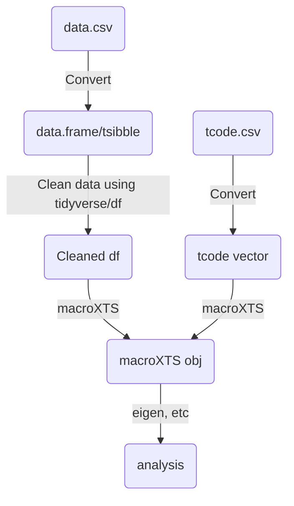

A document explaining the implementation of how datasets are stored/used generally in R.

Note that this is mainly focused on the technical details, and notably omits anything to do with the actual data cleaning (see individual dataset pages for specifics).

## macroXTS class

All cleaned datasets are to be returned using the macroXTS class, which is a really just a wrapper around the wonderful xts() class.

This is because xts() internally behaves like a numeric matrix, making it very easy to pass to things like scale(), unscale(), and most importantly, eigen() for DFM analysis.

xts() itself also has helper methods which can easily extract/filter based on time.

Additionally, ggfortify (despite it being large and clunky) provides many useful additional methods related to plotting.

### Methods for macroXTS

macroXTS comes with unscale, level(), and descr() methods, in addition to the usual xts() methods we have access to.

## Constructor Function

macroXTS() is the main constructor function, and takes in a level dataset, a corresponding vector of tcodes.

The dataset can be of data.frame, xts, tsibble, as long as it has a valid date index.

The general workflow should therefore be, clean using a data.frame() as a base class, then pass this + tcodes to macroXTS().

