## Resources for getting paths working

https://www.randigriffin.com/2017/04/25/how-to-knit-for-mysite.html

https://nb.balaji.blog/posts/pandoc-extract-images/

## Matrix Algebra

## Linear Models

Notation

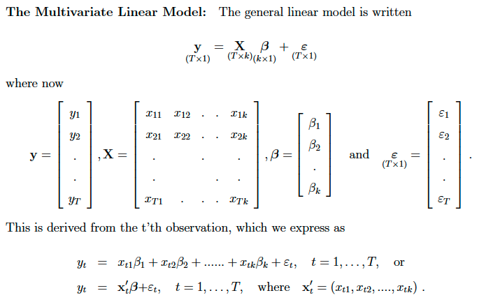

Assumptions/regularity conditions

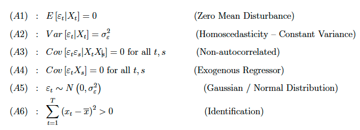

Useful matrix algebra identity 

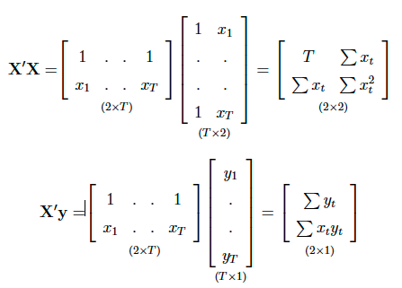

### FWL Theorem

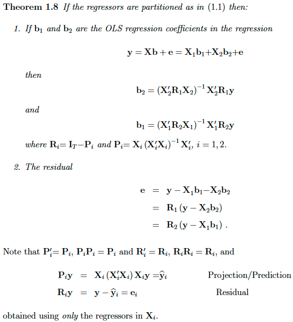

### Statistical Properties of OLS

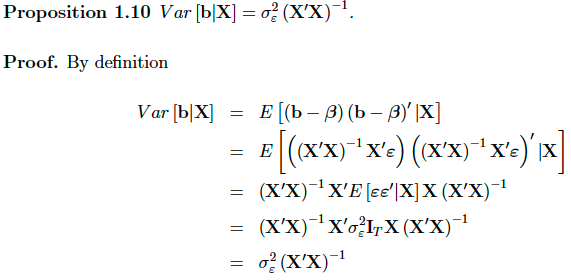

Proof of variance of residuals

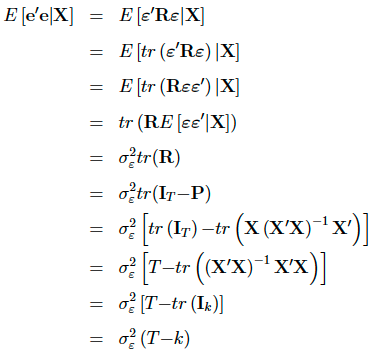

### Inference

The very basic case

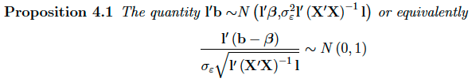

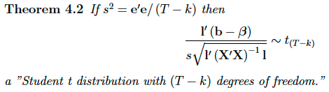

More generally

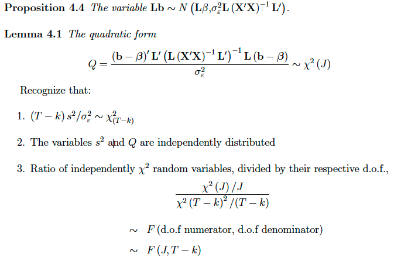

Restricted Least Squares (Lagrange Approach)

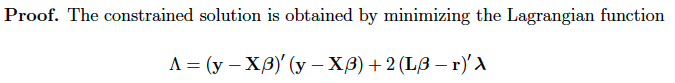

Note the choice of choosing the lagrange multiplier to has a constant in front to simplify things!

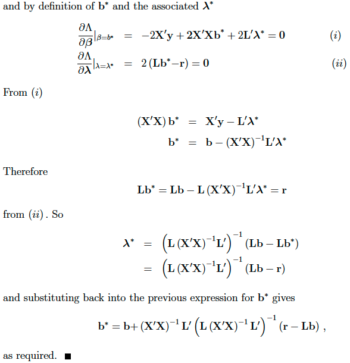

### Chow test

Normal derivation

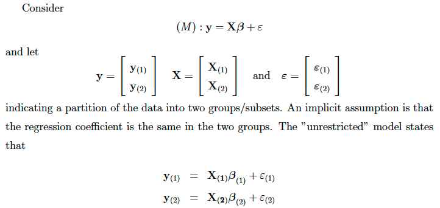

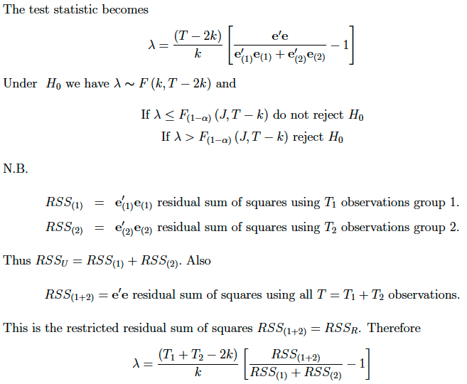

Alternative derivation when one of the sub samples has less observations than regressors:

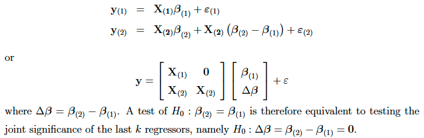

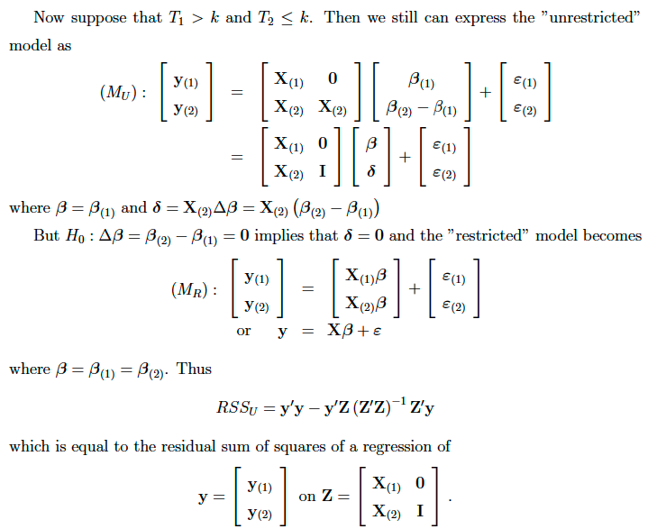

This is an F test with (T - T2 - k) = (T1 - k) dof and T2 indicator variables (restrictions).

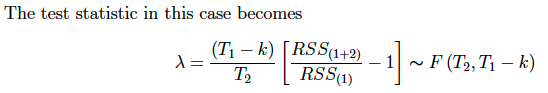

## Likelihood

KL divergence. Note that the relative orders of the thetas are reversed in the fraction. 

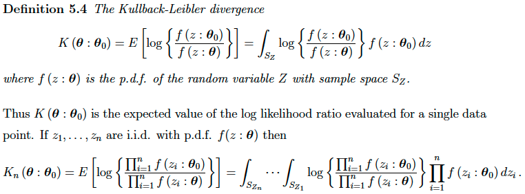

This proof is straightforward, but tedious. Focus on a case of n = 2. Just expand out the multiplication, etc.

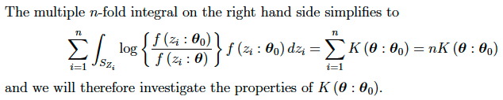

Remember that log(x) is concave, and -log(x) is convex.

### Notation

The support function is the loglikelihood

The score is the 1st derivative of the loglikelihood

The hessian is the 2nd derivative of the loglikelihood

The fisher information is the expected value of the outer product of the score

Under certain conditions, the fisher information is also negative expected value of the hessian

### Conditions

MLE estimator itself *exists*.

In practical terms, need to check that:

1. loglik is continuous and differentiable wrt theta
2. loglik is bounded (finite)
3. limits of loglik, and check that this crosses over 0 (implies a turning point, and hence existence)

Alternatively, use the second derivative directly:

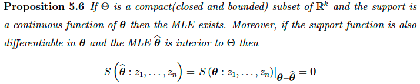

If the parameter space is convex, and loglik is concave (negative 2nd derivative), then the MLE *exists* and is *unique* (note that uniqueness impliex existence).

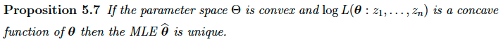

### Statistical Properties of MLE

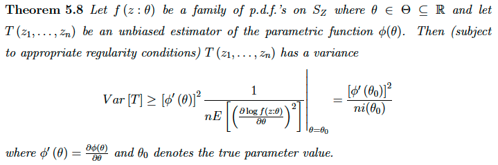

Easy way to check that some *unbiased* estimator reaches the CRLB. 

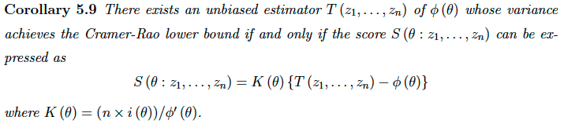

Practically, in the case of MLE, K(theta) can actually be *any* arbitrary function of theta, as noted by Casella and Berger, pg 364.

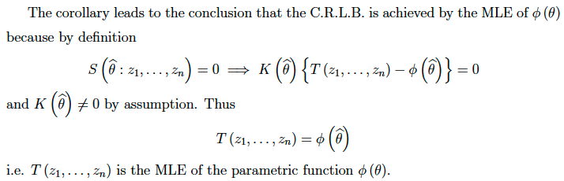

#### OLS MLE

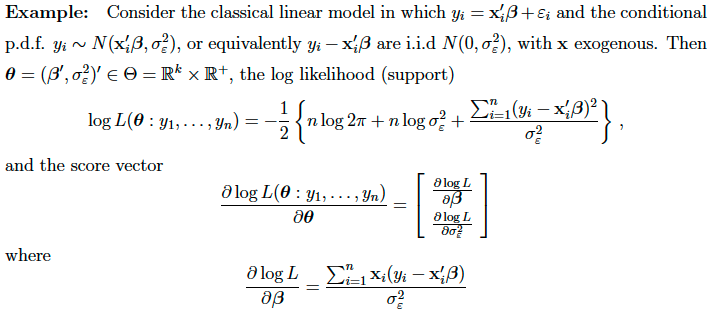

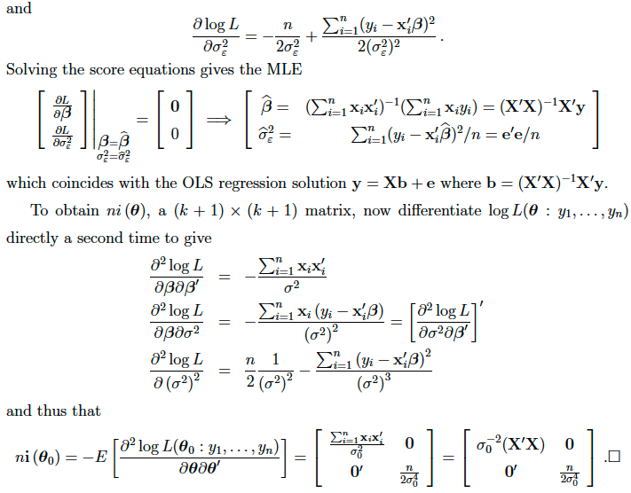

### Asymptotic Properties

General distribution of MLE:

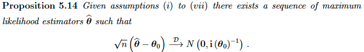

Note that the information matrix relies on *true* theta0, so instead use i(theta hat) as a consistent estimator for it.

### Inference

Restrictions are denoted

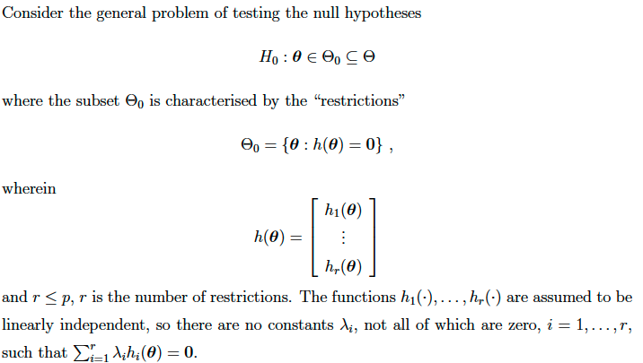

#### Wald Test

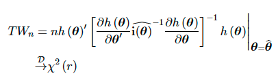

Proof: 1st order Taylor Expand h(theta hat) about true theta 0

#### LM/Gradient Test

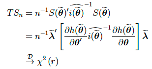

The proof in the notes has typos. 

#### Likelihood Ratio (criterion differnce) test

The easiest one!

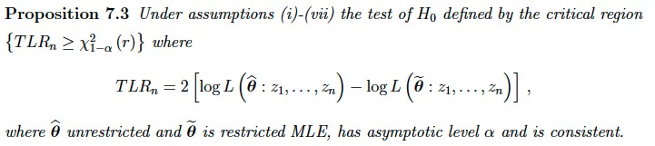

Proof is harder, requires 2nd order Taylor Series expansion. 

## Stochastic Order

## Generalised Method of Moments

Note that Method of Moments is too easy and skipped (not too exciting).

There are p parameters, and k moment conditions

The true moment conditions are denoted by h, s.t. E(h) = 0

The sample moment conditions are denoted by m, whose sample (empirical) means correspond to E(h)

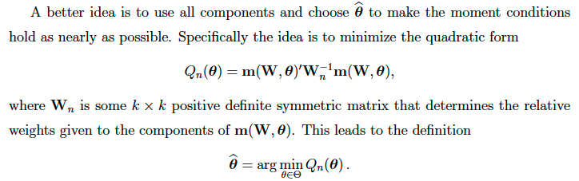

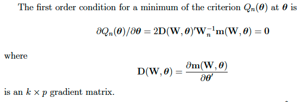

GMM is identified if:

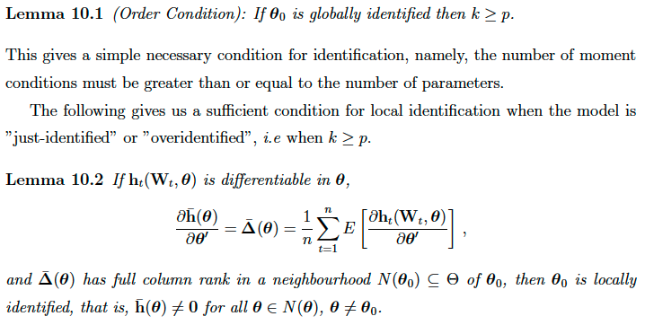

### Asymptotics

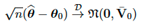

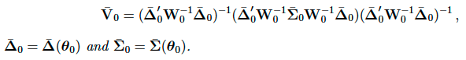

The proof is a straightforward, by tedious Taylor Series expansion about m(theta hat)

Relative Efficiency

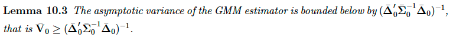

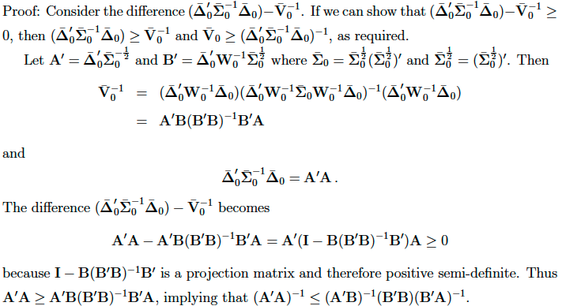

### Weighting matrix

A an efficient weighting matrix needs to chosen up to a proportionality:

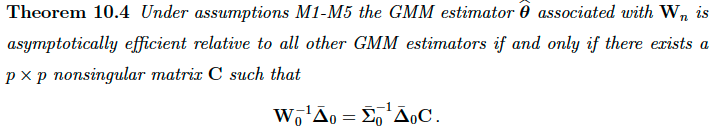

In practice, is it easier to directly work out the variance of the moment conditions and get the standard efficient weighting matrix.

However, the previous result is useful, as this allows us to be sloppy with constants (e.g. missing Ts).

#### OLS

Worked example

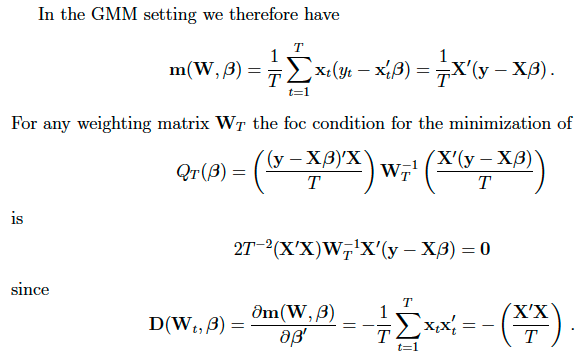

#### IV Regression

Worked Example. Note that sometimes Don is sloppy and specifies different T proportionalities.

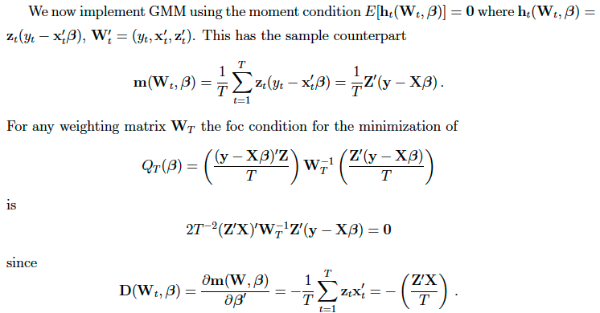

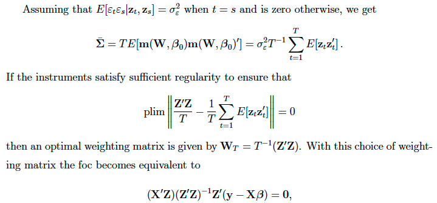

#### MLE

Worked Example

### Inference

#### Wald Test

#### LM/Gradient Test

#### Criterion Difference Test
#### 

### Notation

### Inference

## Extremum Estimators

## Censoring and Truncation

### Truncated

A *truncated* distribution is where any observations exceeding some threshold are not observed at all.

### Censored

A *censored* distribution is where any observations exceeding some threshold are simply recorded as that threshold, but its actual value is unknown (censored).

## Generalised Linear Models (GLMs)

